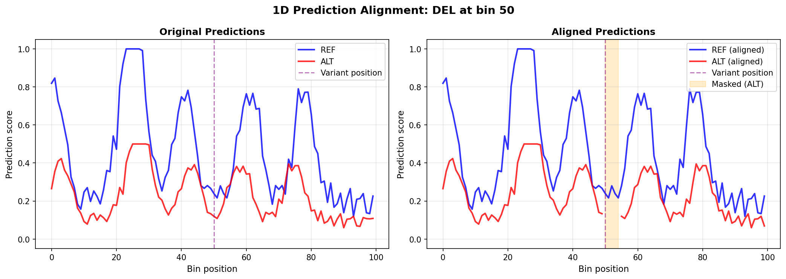
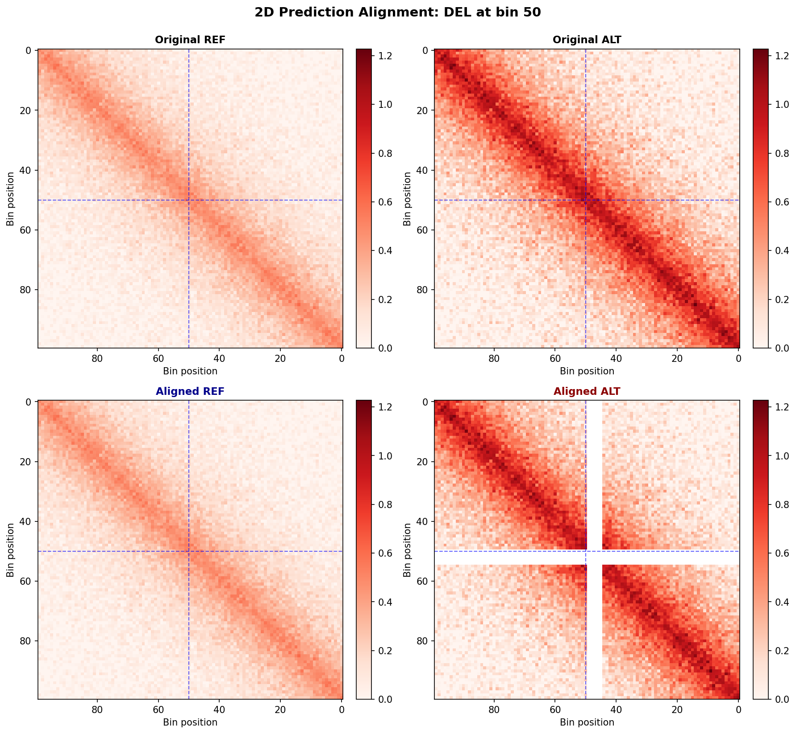
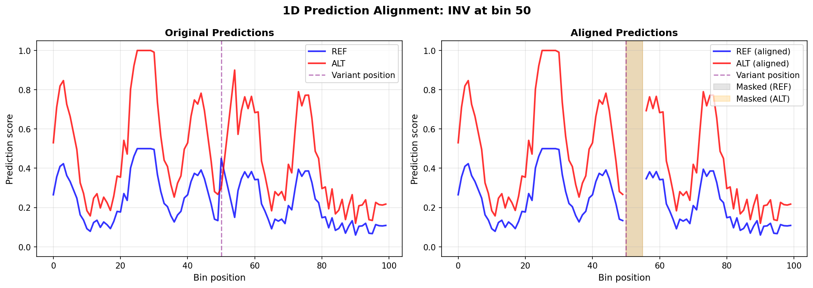
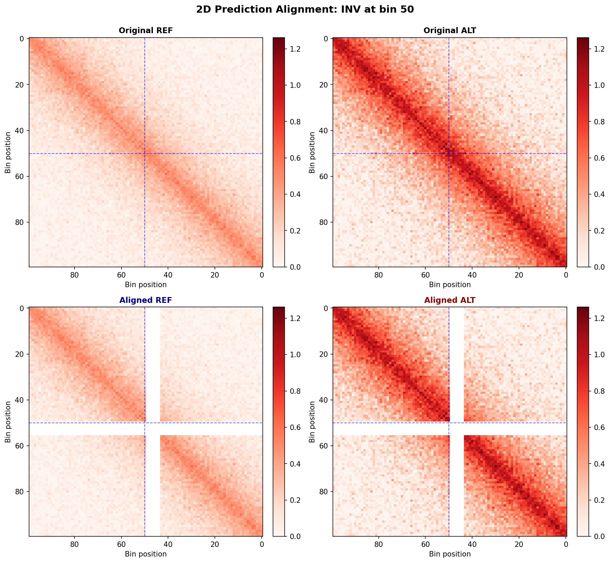
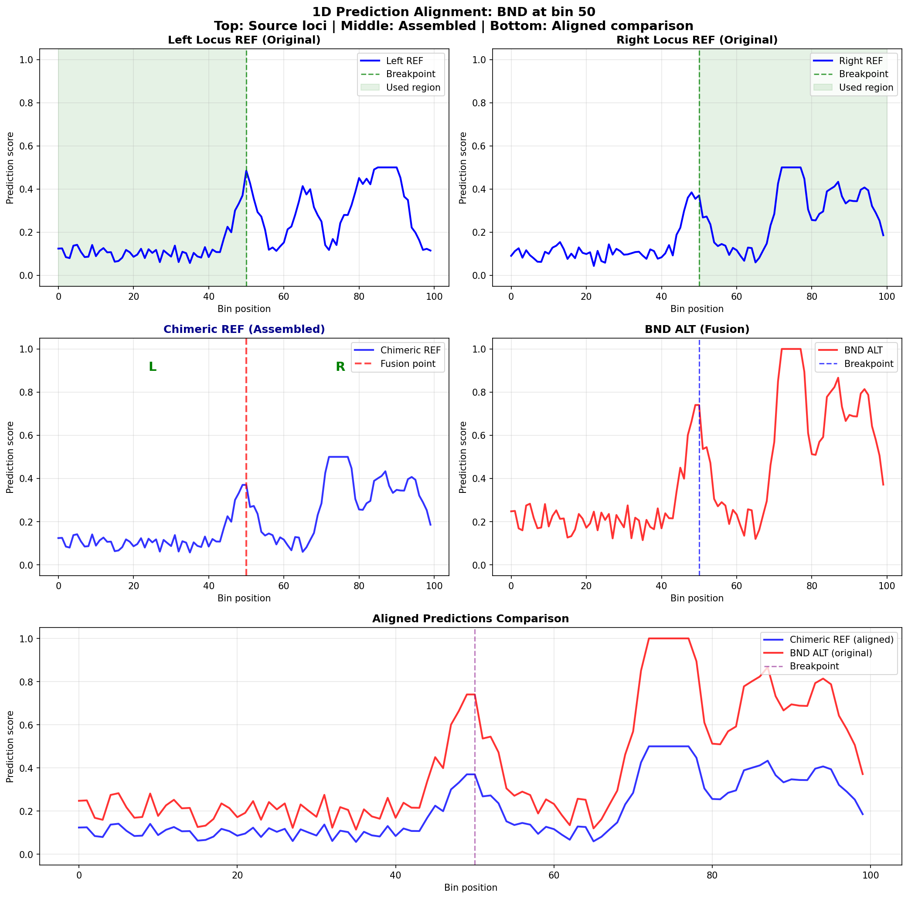
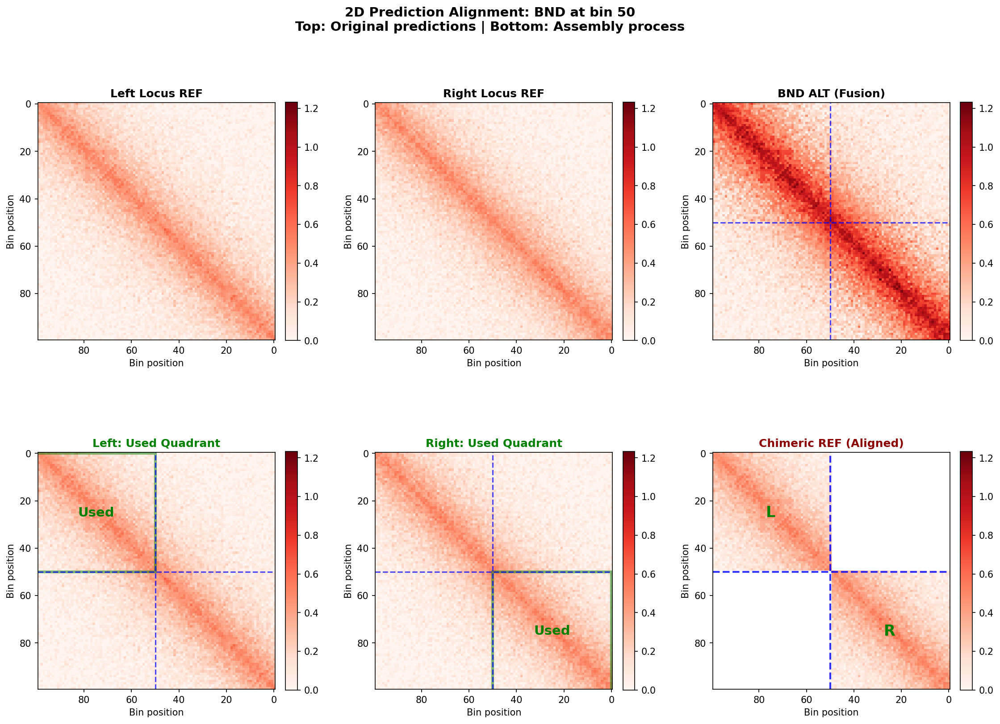

# Prediction Alignment Examples

This page demonstrates how prediction alignment works for different variant types using simulated example data. Each example shows both **1D predictions** (e.g., chromatin accessibility, transcription factor binding) and **2D predictions** (e.g., Hi-C contact maps).

# Variant Type Examples

## INS (Insertion)

Insert NaN bins in reference where insertion occurs in alternate.

### 1D Example


### 2D Example


---

## DEL (Deletion)

Insert NaN bins in ALT where deletion removes sequence from reference.


### 1D Example



### 2D Example



---

## DUP (Duplication)

Same as insertion - duplications add sequence like insertions.


### 1D Example


### 2D Example


---

## INV (Inversion)


Mask inverted bins in both REF and ALT. This follows the original [Supremo](https://github.com/ketringjoni/SuPreMo/blob/9799281ec9b4ea5ea03702931e57950903f75424/scripts/get_Akita_scores_utils.py#L543-L577) implementation.


### 1D Example




### 2D Example




---

## BND (Breakend)

Breakends join two distant genomic loci, creating fusion sequences. BND alignment requires special handling with dual loci.

**Alignment strategy:**
- Reference: Generate predictions from **two separate loci** (left and right breakpoints), then concatenate
- Alternate: Single prediction from the **fused sequence**
- **1D**: Concatenate left + right reference 
- **2D**: Assemble chimeric matrix from quadrants 

### 1D Example



### 2D Example



---


### Additional Resources
- [Prediction Alignment User Guide](prediction_alignment.md) - Complete API reference
- **[03_prediction_alignment.ipynb](../notebooks/03_prediction_alignment.ipynb)** - Notebook example
- [Variant Classification](../_static/images/variant_classification.png) - Variant type decision tree

---

## Reproducing These Examples

To regenerate these visualizations:

```bash
# Run the example generation script
poetry run python create_prediction_alignment_examples.py

# Images will be saved to:
# docs/_static/images/prediction_alignment_examples/
```

The script source: [`create_prediction_alignment_examples.py`](../../create_prediction_alignment_examples.py)
